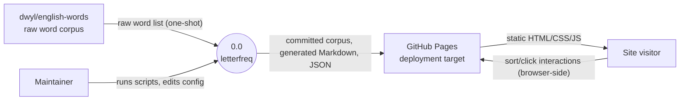

# Context Diagram (Level 0)

> System boundary: letterfreq

## Diagram

## External Entities

| Entity | Description | Inputs to System | Outputs from System |
|--------|-------------|-----------------|---------------------|
| dwyl/english-words | Open-source word list of ~370k entries (Unlicense). One-shot upstream source for the committed corpus files. | Raw word list, fetched manually by `scripts/build_corpora.py` (`dev_docs/design-plans/2026-04-19-ten-letter-page.md`). | None — system does not write back upstream. |
| Maintainer | Project owner: regenerates corpora, runs build scripts, edits Zensical configuration. | Shell commands (`uv run python main.py`, `uv run zensical build`), edits to `main.py`, `main_ten.py`, `zensical.toml` (`zensical.toml`, `a6383ae`; `main.py`, `2982dbe`). | None — maintainer reads built artefacts in `site/` to verify output. |
| GitHub Pages | Static-site hosting target. CI publishes the built `site/` artefact via `.github/workflows/docs.yml` (`.github/workflows/docs.yml`, `d874316`). | Built `site/` directory containing HTML, CSS, JS, JSON. | None. |
| Site visitor | Anonymous reader of the published site. | HTTP requests for static files; client-side sort/click interactions handled by `sort-tables.js` and `trigram-expand.js` (`docs/js/sort-tables.js`, `a6383ae`; `docs/js/trigram-expand.js`, `b8fe9fa`). | None — read-only consumption. |

## System Boundary

**In scope:**
- Filtering and committing word-list corpora derived from upstream.
- Computing letter, bigram, and trigram frequency statistics from the committed corpora.
- Computing scoring rankings for ten-letter words against baseline distributions (`dev_docs/design-plans/2026-04-19-ten-letter-page.md`).
- Rendering Markdown + HTML page sources for Zensical to build into a static site.
- Browser-side interactivity: client-side table sorting and JSON-loaded drill-down panels.

**Out of scope:**
- Live updates from the upstream word list — corpus regeneration is manual and explicit.
- Server-side rendering, search backends, user accounts, or authentication.
- Hosting infrastructure beyond GitHub Pages (handled by external entity).

## Cross-References

- **Parent:** None (top-level diagram).
- **Children:** `1-corpus-generation.md`, `2-frequency-analysis.md`, `3-site-build-serve.md`.
- **Related issues:** None.
- **Related commits:** Bootstrap commit (this design plan).
