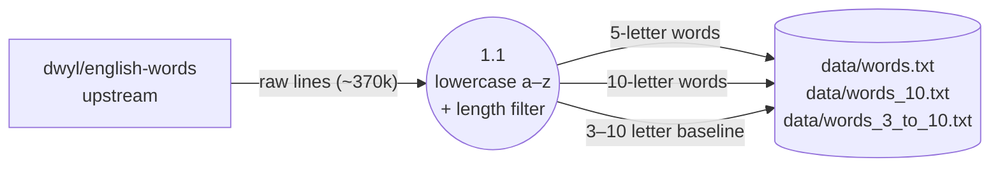

# Corpus Generation (Level 1)

> Decomposes from `0-context-diagram.md`.

One-shot pipeline run by the maintainer. Downloads the dwyl/english-words list, applies a strict lowercase a–z + length filter, and writes per-page word files to `data/`. Outputs are committed; the helper is not invoked during normal builds.

## Diagram

## Process

| Process | Responsibility | Implementation |
|---------|---------------|----------------|
| 1.1 Filter | Strip non a–z lines (apostrophes, digits, mixed case); group by length; emit one file per page-specific length bucket. | `scripts/build_corpora.py` (`dev_docs/design-plans/2026-04-19-ten-letter-page.md`, prospective). |

## Data Stores

| Store | Format | Owner |
|-------|--------|-------|
| `data/words.txt` | One word per line, lowercase a–z, exactly 5 letters; ~15,921 entries (`data/words.txt`, `2982dbe`). | Committed; produced one-shot. |
| `data/words_10.txt` | One word per line, lowercase a–z, exactly 10 letters (`dev_docs/design-plans/2026-04-19-ten-letter-page.md`, prospective). | Committed; produced one-shot. |
| `data/words_3_to_10.txt` | One word per line, lowercase a–z, length 3–10 inclusive (`dev_docs/design-plans/2026-04-19-ten-letter-page.md`, prospective). | Committed; produced one-shot. |

## Cross-References

- **Parent:** `0-context-diagram.md`.
- **Children:** None.
- **Related issues:** None.
- **Related commits:** `2982dbe` (initial 5-letter corpus); design plan introduces the two new files.
