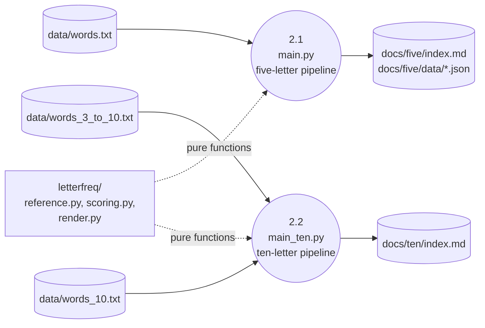

# Frequency Analysis (Level 1)

> Decomposes from `0-context-diagram.md`.

Two parallel Python pipelines compute frequency statistics from the committed corpora and emit Markdown + JSON page sources for Zensical to build. Both pipelines follow the FCIS pattern: pure computation modules separated from imperative entry scripts.

## Diagram

## Processes

| Process | Responsibility | Implementation |
|---------|---------------|----------------|
| 2.1 Five-letter pipeline | Read `data/words.txt`; compute overall + positional unigram, bigram, trigram frequencies; emit Markdown + JSON for `/five/`. | `main.py` (`main.py`, `2982dbe`). After the design plan it writes to `docs/five/index.md` and `docs/five/data/` instead of `docs/index.md` and `docs/data/` (`dev_docs/design-plans/2026-04-19-ten-letter-page.md`). |
| 2.2 Ten-letter pipeline | Read `data/words_10.txt` and `data/words_3_to_10.txt`; compute baseline letter/bigram/trigram rates; rank ten-letter words by three scores; emit Markdown for `/ten/`. | `main_ten.py` (`dev_docs/design-plans/2026-04-19-ten-letter-page.md`, prospective). |
| Pure modules | Functional core: counting, rate computation, scoring, HTML rendering. Side-effect-free. Independently testable. | `letterfreq/reference.py`, `letterfreq/scoring.py`, `letterfreq/render.py` (`dev_docs/design-plans/2026-04-19-ten-letter-page.md`, prospective). |

## Data Stores

| Store | Format | Producer | Consumer |
|-------|--------|----------|----------|
| `docs/five/index.md` | Markdown with embedded HTML tables (frontmatter, sortable tables, bigram/trigram heatmaps). | `main.py` | Zensical build (process 3.1). |
| `docs/five/data/bigrams.json` | Sparse nested dict of bigram counts keyed by adjacent position pair. | `main.py` (`main.py::compute_bigrams`, `2982dbe`). | `sort-tables.js` (browser-side, process 3.2). |
| `docs/five/data/trigrams.json` | Sparse nested dict of trigram counts keyed by gap position and word window. | `main.py` (`main.py::compute_trigrams`, `2982dbe`). | `trigram-expand.js` (browser-side, process 3.2). |
| `docs/ten/index.md` | Markdown with six embedded HTML tables (3 reference + 3 ranking) (`dev_docs/design-plans/2026-04-19-ten-letter-page.md`). | `main_ten.py` | Zensical build (process 3.1). |

## Cross-References

- **Parent:** `0-context-diagram.md`.
- **Children:** None (the pure modules are described inline, not decomposed further).
- **Related issues:** None.
- **Related commits:** `2982dbe` (current `main.py`); design plan introduces `main_ten.py` and the `letterfreq/` package.
