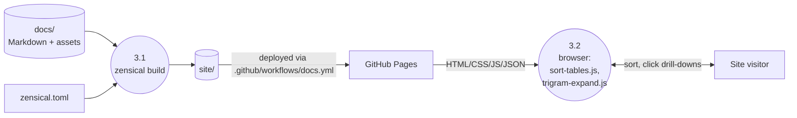

# Site Build and Serve (Level 1)

> Decomposes from `0-context-diagram.md`.

Two distinct phases: (1) Zensical builds the static `site/` artefact from `docs/`, run by maintainer or CI; (2) Browser-side interactivity executes in the visitor's browser when the published site is loaded.

## Diagram

## Processes

| Process | Responsibility | Implementation |
|---------|---------------|----------------|
| 3.1 Zensical build | Convert `docs/*.md` plus theme assets to a fully-rendered static site under `site/`. Driven by `zensical.toml` configuration including navigation, theme palette, extra CSS/JS. | `zensical>=0.0.33` (`pyproject.toml`, `f225141` updated by `dev_docs/design-plans/2026-04-19-ten-letter-page.md`). Configuration in `zensical.toml` (`zensical.toml`, `a6383ae`). CI invocation in `.github/workflows/docs.yml` (`.github/workflows/docs.yml`, `d874316`). |
| 3.2 Browser-side interactivity | Sort tables on column-header click; expand drill-down panels under bigram/trigram cells by fetching JSON. | `docs/js/sort-tables.js` (`docs/js/sort-tables.js::fetch`, `a6383ae`) and `docs/js/trigram-expand.js` (`docs/js/trigram-expand.js::fetch`, `b8fe9fa`). Both use bare-relative `fetch("data/<file>.json")`; after the design plan, JSON files are co-located under `docs/five/data/` so the relative path continues to resolve correctly. |

## Data Stores

| Store | Format | Producer | Consumer |
|-------|--------|----------|----------|
| `site/` | Built static HTML/CSS/JS bundle. Gitignored. | Process 3.1. | Process 3.2 (after deployment). |

## Page Layout (post–design-plan)

| URL | Source | Notes |
|-----|--------|-------|
| `/` | `docs/index.md` (new landing page, `dev_docs/design-plans/2026-04-19-ten-letter-page.md`). | Brief intro plus links to `/five/` and `/ten/`. |
| `/five/` | `docs/five/index.md` (moved from `docs/index.md`). | Existing five-letter analysis, behaviour preserved. |
| `/ten/` | `docs/ten/index.md` (new). | Six tables (3 reference + 3 ranking). |

## Cross-References

- **Parent:** `0-context-diagram.md`.
- **Children:** None.
- **Related issues:** None.
- **Related commits:** `a6383ae` (sortable tables + drill-downs), `b8fe9fa` (trigram expand), `d874316` (Pages workflow); design plan introduces multi-page layout.
